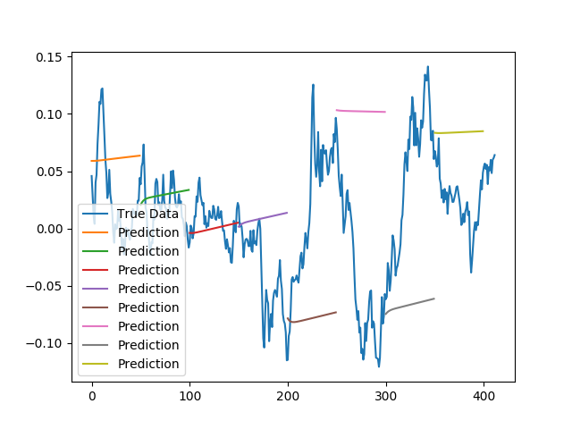
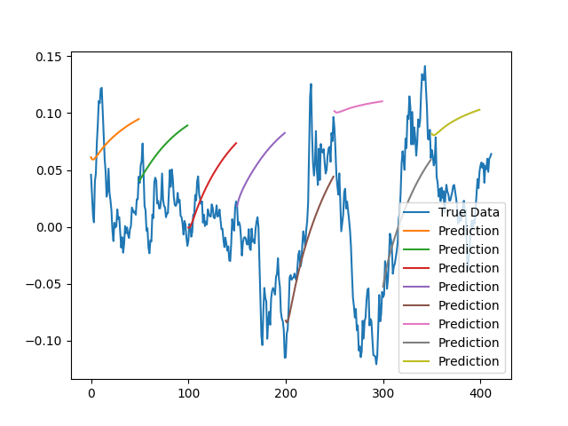
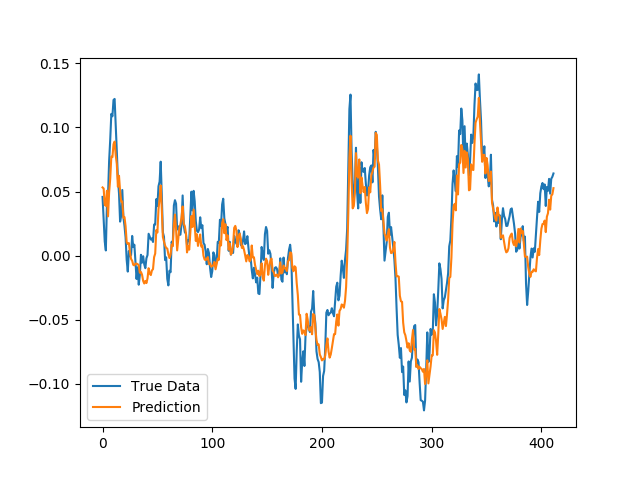

<!-- # LSTM Neural Network for Time Series Prediction

LSTM built using the Keras Python package to predict time series steps and sequences. Includes sin wave and stock market data.

[Full article write-up for this code](http://www.jakob-aungiers.com/articles/a/LSTM-Neural-Network-for-Time-Series-Prediction)

[Video on the workings and usage of LSTMs and run-through of this code](https://www.youtube.com/watch?v=2np77NOdnwk)

## Requirements
**Update:** As of 08-03-2017 this code has been updated from Python 2.7 to Python 3.5.

This is to make it available to run natively on Windows TensorFlow installations ([Tutorial on how to install TensorFlow natively on Windows](http://www.jakob-aungiers.com/articles/a/Installing-TensorFlow-GPU-Natively-on-Windows-10)) -->

* Python 3.5
* TensorFlow 1.0
* Numpy 1.12.0
* Keras 1.2.2
* Matplotlib 2.0.0

Output 1:

Output 2:

Output 3:

